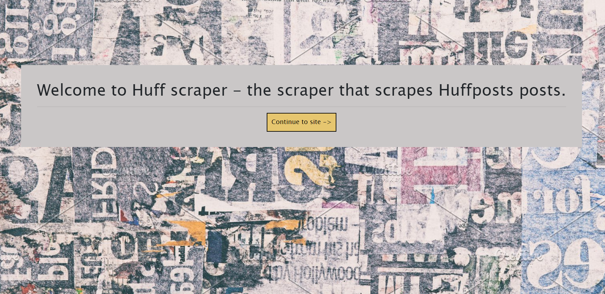

# [Huffpost Scraper](https://huffpost-scraper-app.herokuapp.com/)

Overview
Simple app that allows user to scrape the most recent articles from Huffpost.com and comment on an article with an attached username.

This app utilizes Handlebars and Mongo with the cheerio scraper module.

User guide:
Click continue on landing page, then hit the scrape button in the header. The articles will populate below. You can then add a comment on your choice article with whatever username you choose. 

